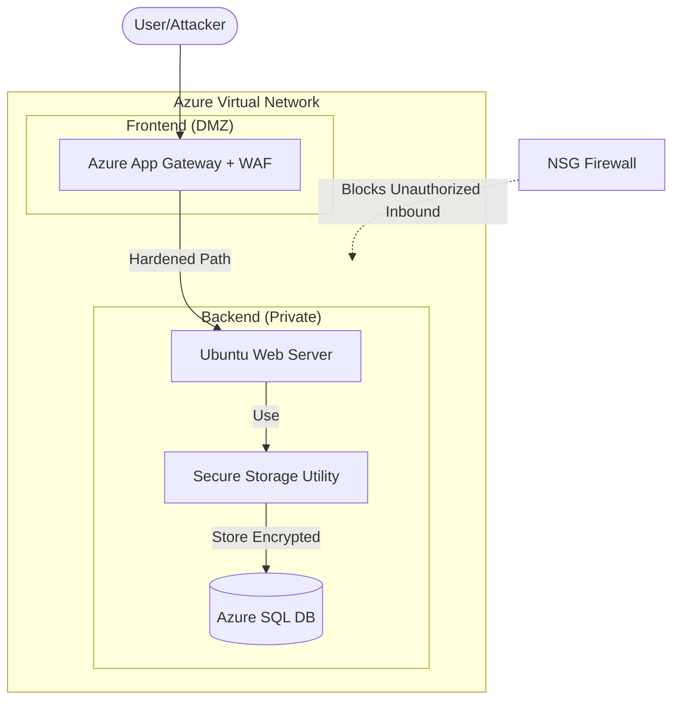

# High-Level Design (HLD): Layered Retail Security

## 1. Architecture Overview
The architecture implements **Defense-in-Depth**, combining a hardened Azure network perimeter with a standalone Python-based data encryption utility.

### 1.1 Diagram Components
- **Perimeter:** Azure Application Gateway with **WAF (Prevention Mode)** blocking L7 attacks.
- **Isolated Network:** A VNet with strict NSG rules separating the DMZ from the backend.
- **Hardened Compute:** Ubuntu VM hosting both the web service and the **Secure Storage Utility**.
- **Data Protection:** Files are encrypted with **AES-256-GCM** before being stored at rest.

## 2. Network & Application Layout

## 3. Integrated Data Flow
1. **Perimeter Defense:** User requests are filtered by the WAF. Malicious payloads (SQLi/XSS) are dropped at the edge.
2. **Compute Isolation:** Only authorized traffic from the App Gateway Subnet can reach the Backend Subnet.
3. **Application Logic:** The Web Server processes sensitive retail data.
4. **Data Protection:** Before persistent storage, the **Secure Storage Utility** encrypts the data using a password-derived AES key.
5. **Secure Storage:** The encrypted blobs are stored in the database or filesystem.

## 4. Compliance Mapping
| Control Category | Azure / Tools | Regulatory Standard |
| :--- | :--- | :--- |
| Network Defense | App Gateway WAF | PCI DSS 1.1, 6.6 |
| Data-at-Rest Protection | AES-256-GCM Script | PCI DSS 3.4, GDPR Art 32 |
| Identity & Access | IAM / Managed ID | PCI DSS 7 |
| Auditing | Azure Monitor | PCI DSS 10 |
